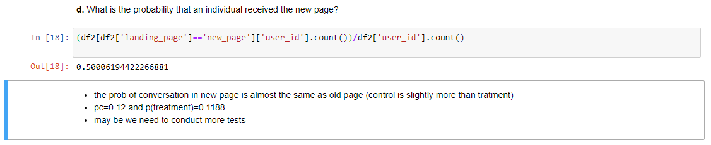
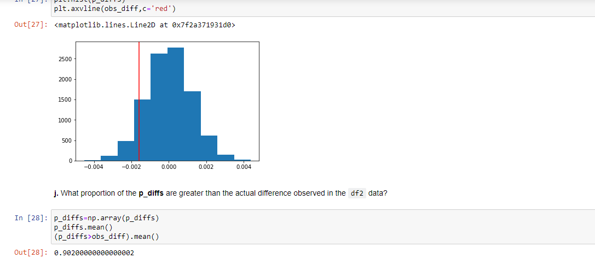

## A/B Testing Project: Website Redesign Analysis

### Project Description
This project aims to analyze the results of an A/B testing experiment conducted by a company to decide whether they should implement the new webpage, keep the old webpage, or potentially extend the experiment for further evaluation. The analysis also explores the impact of user country on conversion rates.

### Project Goals
- Analyze the A/B testing dataset to provide insights into the performance of the new and old webpage designs.
- Investigate the relationship between user country and conversion rates.
- Help the company make an informed decision based on statistical analysis.

### Project Methodology
The A/B testing methodology involves comparing the performance of the old webpage design (control group) with the new webpage design (treatment group) using appropriate statistical techniques. Logistic regression is also utilized to assess the impact of user country on conversion rates.

### Repository Structure
```
├── data/
│   └── ab_data.csv , countries.csv               # Dataset containing A/B testing results
├── notebooks/
│   └── A_B_Testing_Analysis.ipynb  # Jupyter notebook for A/B testing and analysis
├── snapshots/
│   └── screenshots.png             # Screenshots of key visualizations
├── LICENSE                          # License file (e.g., MIT License)
└── README.md                        # Project documentation and overview

```
### Results and Conclusion
- **Part b - Data Cleansing and Preprocessing:**
    The data has been checked for null values, and duplicates have been successfully removed through data cleansing and preprocessing.

    

- **Part c - probability :**
    After conducting the probability test, it is observed that the conversion probability in the new page is almost the same as that in the old page. Further testing may be necessary to draw definitive conclusions.

    

- **Part d - Sampling Distribution and Estimation:**
    A sampling distribution has been created for the "difference in the converted probability" between simulated samples. Over 10,000 iterations, an estimate has been calculated to assess the potential impact of the new webpage design.

- **Part e - Histogram of Differences:**
    A histogram of the differences in converted probabilities has been plotted, providing insight into the distribution of the simulated samples.

    

- **Part f - Hypothesis Testing Conclusion:**
    Based on the calculated p-value and statistical tests, it is concluded that the new webpage design did not significantly affect the conversion rate. The p-value is greater than the rejection area threshold, indicating a failure to reject the null hypothesis. The p-value is also greater than the alpha level, and the z-statistic further supports the conclusion.
  
  

- **Part g - Logistic Regression and Additional Factors:**
    The logistic regression analysis, both for the webpage design and user country, suggests that the new page is not statistically significant in influencing conversion rates. While the p-value in regression is low, indicating statistical significance, it's important to consider additional factors that could potentially impact the results.
  
  
  
- **Part h - Impact of User Country:**
    The analysis was extended to assess the impact of user country on conversion rates. It is concluded that neither the new webpage design nor user country significantly affected the conversion rate.
  
  
  
### Data
The dataset used for this analysis can be found in the `data/` directory. The dataset contains columns including `user_id`, `timestamp`, `group`, `landing_page`, `converted`, and `country`.

...

